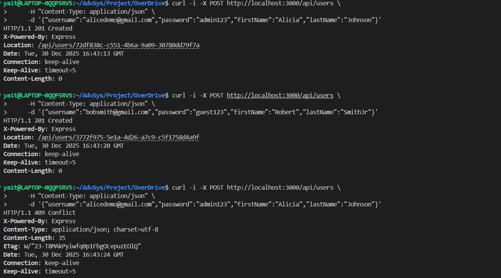
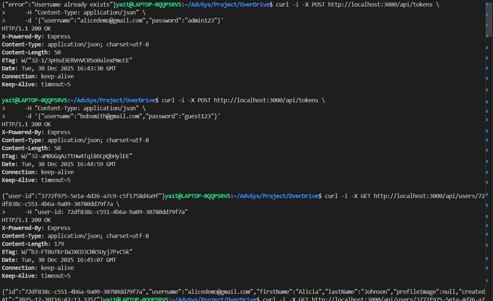
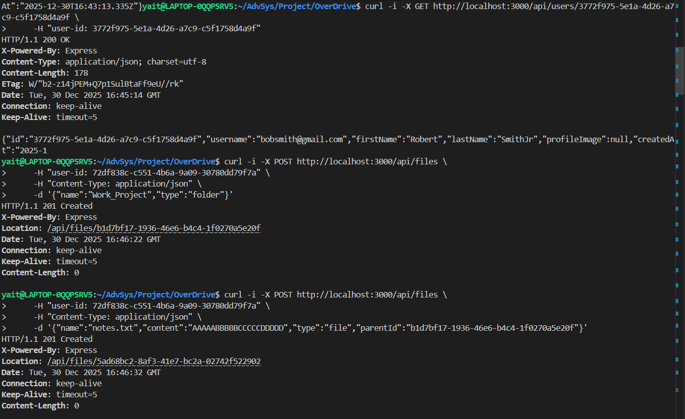
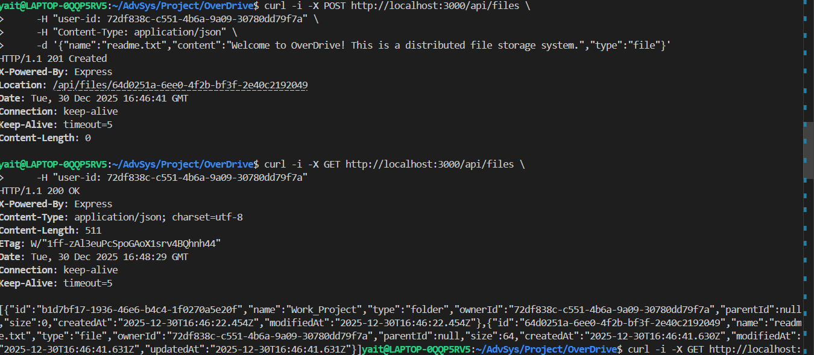
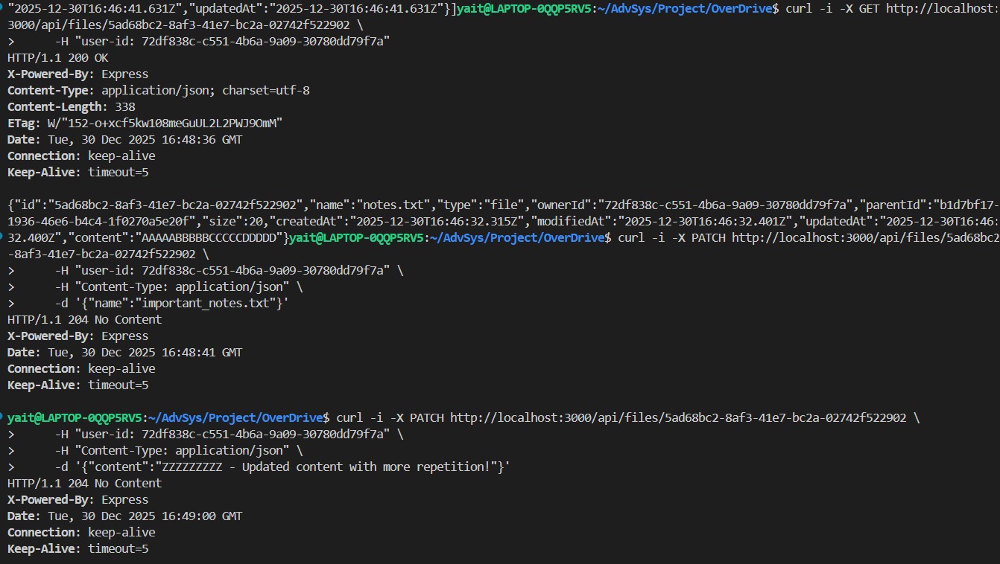
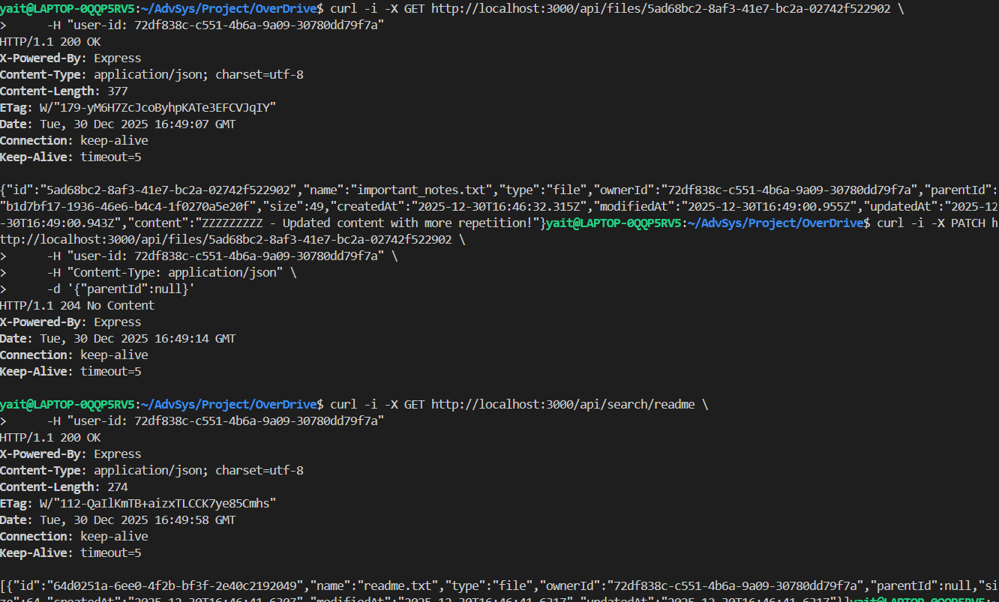
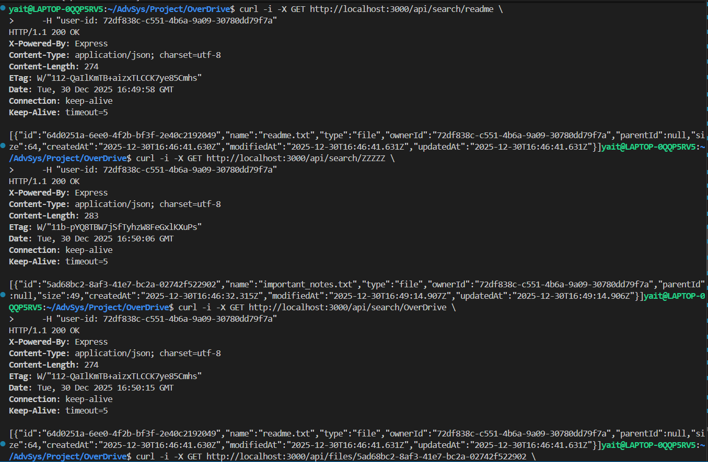
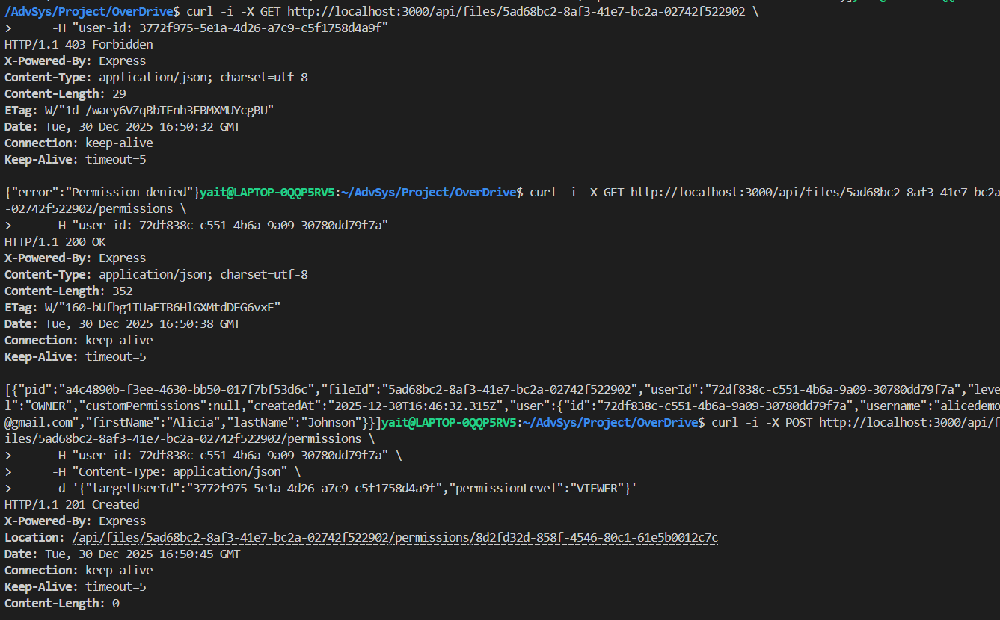
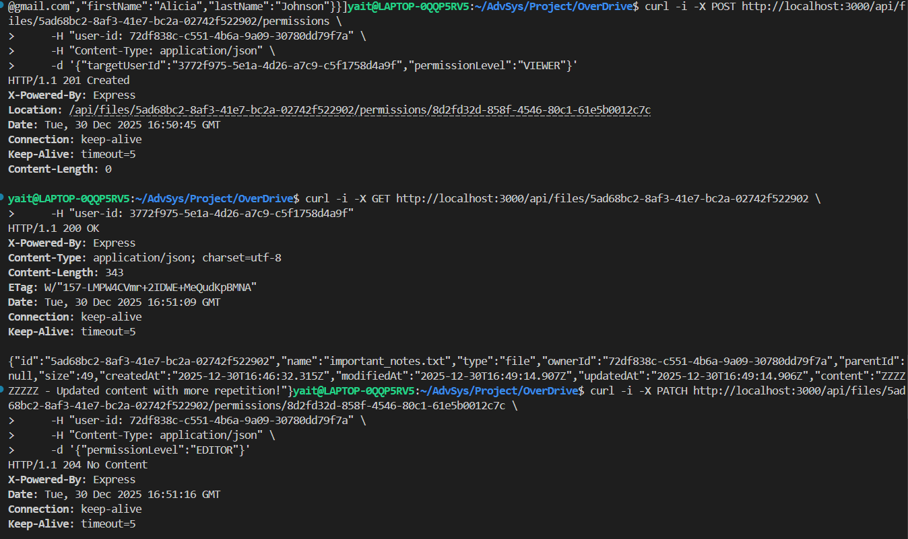
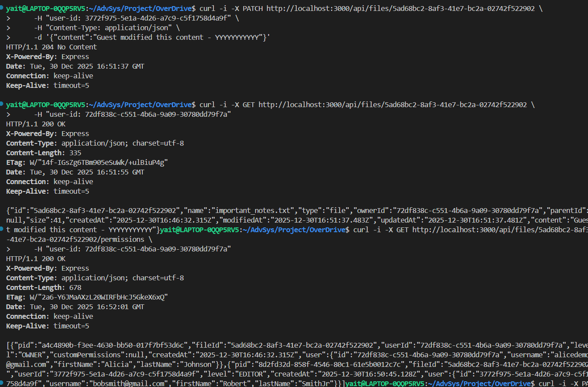

# OverDrive

A full-stack, distributed file storage system featuring a Node.js Web API layer and a high-performance C++ storage engine with RLE compression.

## Overview

OverDrive is a networked file storage system featuring:
- **Web Server (Node.js)**: Handles JWT-based authentication (Gmail-only), permissions, and file metadata.
- **Storage Server (C++)**: A high-performance engine for file persistence, featuring custom RLE compression and multi-threaded searching.
- **Security & Validation**: JWT token authentication, strict email validation, password length checks, and owner-only file access.
- **RESTful API**: Clean HTTP interface for managing users and files.
- **User Features**: Starred files and recently accessed file tracking with automatic interaction recording.
- **Dockerized Microservices**: Seamlessly orchestrated using Docker Compose.

### System Architecture
The system is now split into three main services communicating over a private TCP bridge:
1. Client: Interacts with the system via curl or HTTP requests.
2. Web Server (Port 3000): Manages logic, users, and redirects data to the storage backend.
3. Storage Server (Port 5555): Manages physical file I/O, compression, and content-based search.


## Getting Started

### Prerequisites
- Docker & Docker Compose

### Step 1: Build & Start

```bash
docker-compose up --build -d
```
This command starts both the Web Server and the Storage Server.

### Step 2: Running Tests (Optional)
To verify the system integrity (C++ logic and Protocol):

```bash
docker-compose run --rm tests
```

## API Reference

### Authentication
All protected endpoints require a JWT token in the `Authorization` header:
```
Authorization: Bearer <JWT_TOKEN>
```

### Endpoints

| Method | Endpoint | Auth Required | Description |
|:---:|:---|:---:|:---|
| `POST` | `/api/users` | ❌ | **Register**: Create a new account (Gmail only, 4+ char password). Fields: `username`, `password`, `firstName` (required), `lastName` (optional, defaults to `null`), `profileImage` (optional Base64, defaults to `null`) |
| `GET` | `/api/users/:id` | ✅ | **Get User Profile**: Retrieve user details (username, firstName, lastName, profileImage) |
| `POST` | `/api/tokens` | ❌ | **Login**: Authenticate user and retrieve JWT token. Returns: `{ token: "<JWT>" }` |
| `POST` | `/api/files` | ✅ | **Create**: Upload a new file or create a folder |
| `GET` | `/api/files` | ✅ | **List All**: Retrieve all files and folders at root level (/) with user as Viewer|
| `GET` | `/api/files/starred` | ✅ | **Get Starred Files**: Retrieve all files starred by the current user with metadata (`isStarred`, `lastViewedAt`, `lastEditedAt`) |
| `GET` | `/api/files/recent` | ✅ | **Get Recent Files**: Retrieve recently accessed files (viewed or edited), sorted by most recent interaction first. Includes `lastInteractionType` (VIEW/EDIT) |
| `GET` | `/api/files/:id` | ✅ | **Fetch**: Get full metadata and content of a specific file/folder. Automatically records VIEW interaction |
| `PATCH` | `/api/files/:id` | ✅ | **Update**: Update file/folder name or content or location. Automatically records EDIT interaction |
| `POST` | `/api/files/:id/star` | ✅ | **Toggle Star**: Star or unstar a file. Returns `{ fileId, isStarred }` |
| `DELETE` | `/api/files/:id` | ✅ | **Delete**: Remove a file or folder (includes recursive deletion) |
| `GET` | `/api/search/:query` | ✅ | **Search**: Global search by name or content |
| `GET` | `/api/files/:id/permissions` | ✅ | **Get Permissions**: Retrieve all permissions for a specific file/folder |
| `POST` | `/api/files/:id/permissions` | ✅ | **Grant Permission**: Create new permission for a user. Body: `{ targetUserId, permissionLevel }`. Levels: VIEWER, EDITOR, or OWNER. When `permissionLevel=OWNER`, ownership transfer occurs (requester must be current owner) |
| `PATCH` | `/api/files/:id/permissions/:pId` | ✅ | **Update Permission**: Modify permission level. Body: `{ permissionLevel }`. Allowed levels: VIEWER, EDITOR, or OWNER. When `permissionLevel=OWNER`, ownership transfer occurs (requester must be current owner) |
| `DELETE` | `/api/files/:id/permissions/:pId` | ✅ | **Revoke Permission**: Remove a specific permission |

---

### Status Codes
- `200 OK` - Success.
- `201 Created` - Resource created successfully.
- `204 No Content` - Success with no response body (update/delete operations).
- `400 Bad Request` - Validation failed (e.g., invalid email, missing fields).
- `401 Unauthorized` - Missing or invalid JWT token.
- `403 Forbidden` - User lacks permission to access the resource.
- `404 Not Found` - Resource or User does not exist.
- `409 Conflict` - Resource already exists (e.g., duplicate username).

---

## API Usage Guide (Interactive Demo)
Follow these steps to explore the system. Replace <...> values with actual IDs returned from the server.

### 1. Identity & Access
1.1 Register User
```Bash
curl -i -X POST http://localhost:3000/api/users \
     -H "Content-Type: application/json" \
     -d "{\"username\":\"<GMAIL_ADDRESS>\",\"password\":\"<PASSWORD>\",\"firstName\":\"<FIRST_NAME>\",\"lastName\":\"<LAST_NAME>\"}"
```
Expected Response: 201 Created. Header Location contains the USER_ID.
Note: `lastName` and `profileImage` are optional fields.

1.2 User Login
```Bash
curl -i -X POST http://localhost:3000/api/tokens \
     -H "Content-Type: application/json" \
     -d "{\"username\":\"<GMAIL_ADDRESS>\",\"password\":\"<PASSWORD>\"}"
```
Expected Response: 200 OK. Body: `{"token": "eyJhbGciOiJIUzI1NiIsInR5cCI6IkpXVCJ9..."}`. Save this token for subsequent requests.

**Note**: The JWT token is valid for 24 hours and must be included in the `Authorization` header as `Bearer <TOKEN>` for all protected endpoints.

1.3 Get User Profile
```Bash
curl -i -X GET http://localhost:3000/api/users/<USER_ID> \
     -H "Authorization: Bearer <TOKEN>"
```
Expected Response: 200 OK. Body: User object (ID, username, firstName, lastName, profileImage).

### 2. File & Folder Management
2.1 Create Folder
```Bash
curl -i -X POST http://localhost:3000/api/files \
     -H "Authorization: Bearer <TOKEN>" \
     -H "Content-Type: application/json" \
     -d "{\"name\":\"Work_Project\",\"type\":\"folder\"}"
```
Expected Response: 201 Created. Header Location contains the FOLDER_ID.

2.2 Upload File (with RLE Compression)
```Bash
curl -i -X POST http://localhost:3000/api/files \
     -H "Authorization: Bearer <TOKEN>" \
     -H "Content-Type: application/json" \
     -d "{\"name\":\"notes.txt\",\"content\":\"AAAAABBBBB\",\"type\":\"file\",\"parentId\":\"<FOLDER_ID_OR_NULL>\"}"
```
Expected Response: 201 Created. Data is automatically compressed in the C++ backend.

2.3 List All Files (Tree Root)
```Bash
curl -i -X GET http://localhost:3000/api/files \
     -H "Authorization: Bearer <TOKEN>"
```
Expected Response: 200 OK. Returns an array of file/folder objects.

2.4 Get File Metadata & Content
```Bash
curl -i -X GET http://localhost:3000/api/files/<FILE_ID> \
     -H "Authorization: Bearer <TOKEN>"
```
Expected Response: 200 OK. Content is transparently decompressed and returned as plain text. Automatically records a VIEW interaction.

2.5 Update File/Folder (Name, Content, or Location)
```Bash
# Update name
curl -i -X PATCH http://localhost:3000/api/files/<FILE_ID> \
     -H "Authorization: Bearer <TOKEN>" \
     -H "Content-Type: application/json" \
     -d "{\"name\":\"new_filename.txt\"}"

# Update content (files only)
curl -i -X PATCH http://localhost:3000/api/files/<FILE_ID> \
     -H "Authorization: Bearer <TOKEN>" \
     -H "Content-Type: application/json" \
     -d "{\"content\":\"Updated content\"}"

# Move to different parent folder
curl -i -X PATCH http://localhost:3000/api/files/<FILE_ID> \
     -H "Authorization: Bearer <TOKEN>" \
     -H "Content-Type: application/json" \
     -d "{\"parentId\":\"<NEW_FOLDER_ID>\"}"
```
Expected Response: 204 No Content. Automatically records an EDIT interaction.
Note: You can update name, content, and/or parentId in any combination.

2.6 Delete File/Folder
```Bash
curl -i -X DELETE http://localhost:3000/api/files/<FILE_ID> \
     -H "Authorization: Bearer <TOKEN>"
```
Expected Response: 204 No Content.

### 3. Advanced Features
3.1 Smart Search (Name & Content)
```Bash
curl -i -X GET http://localhost:3000/api/search/<TERM> \
     -H "Authorization: Bearer <TOKEN>"
```
Expected Response: 200 OK. Searches file names and performs deep-content search within compressed RLE data.

3.2 Get File/Folder Permissions
```Bash
curl -i -X GET http://localhost:3000/api/files/<FILE_ID>/permissions \
     -H "Authorization: Bearer <TOKEN>"
```
Expected Response: 200 OK. Returns array of all permissions for the file/folder.

3.3 Grant Permission (RBAC)
```Bash
curl -i -X POST http://localhost:3000/api/files/<FILE_ID>/permissions \
     -H "Authorization: Bearer <TOKEN>" \
     -H "Content-Type: application/json" \
     -d "{\"targetUserId\":\"<GUEST_ID>\",\"permissionLevel\":\"VIEWER\"}"
```
Expected Response: 201 Created. Header Location contains the permission ID.
Supported levels: VIEWER, EDITOR, OWNER.

3.4 Update Permission Level (or Transfer Ownership)
```Bash
# Change permission level to EDITOR
curl -i -X PATCH http://localhost:3000/api/files/<FILE_ID>/permissions/<PERMISSION_ID> \
     -H "Authorization: Bearer <TOKEN>" \
     -H "Content-Type: application/json" \
     -d "{\"permissionLevel\":\"EDITOR\"}"

# Transfer ownership to the user who has this permission
curl -i -X PATCH http://localhost:3000/api/files/<FILE_ID>/permissions/<PERMISSION_ID> \
     -H "Authorization: Bearer <TOKEN>" \
     -H "Content-Type: application/json" \
     -d "{\"permissionLevel\":\"OWNER\"}"
```
Expected Response: 204 No Content.
Note: Supported levels are VIEWER, EDITOR, or OWNER. When setting OWNER, ownership is transferred to the user who has this permission (requester must be current owner).

3.5 Revoke Permission
```Bash
curl -i -X DELETE http://localhost:3000/api/files/<FILE_ID>/permissions/<PERMISSION_ID> \
     -H "Authorization: Bearer <TOKEN>"
```
Expected Response: 204 No Content.

### 4. User Activity Tracking: Starred & Recent Files

4.1 Star a File
```Bash
curl -i -X POST http://localhost:3000/api/files/<FILE_ID>/star \
     -H "Authorization: Bearer <TOKEN>"
```
Expected Response: 200 OK. Body: `{"fileId": "...", "isStarred": true}`
Note: Calling this endpoint again will toggle the star status (unstar the file).

4.2 Get Starred Files
```Bash
curl -i -X GET http://localhost:3000/api/files/starred \
     -H "Authorization: Bearer <TOKEN>"
```
Expected Response: 200 OK. Returns array of starred files with additional metadata:
- `isStarred`: Boolean (always true for this endpoint)
- `lastViewedAt`: ISO timestamp of last view
- `lastEditedAt`: ISO timestamp of last edit (or null)
- `lastInteractionType`: "VIEW" or "EDIT"

4.3 Get Recently Accessed Files
```Bash
curl -i -X GET http://localhost:3000/api/files/recent \
     -H "Authorization: Bearer <TOKEN>"
```
Expected Response: 200 OK. Returns up to 20 recently accessed files, sorted by most recent interaction first.
Each file includes metadata about when and how it was accessed:
- `lastViewedAt`: Timestamp of last GET request
- `lastEditedAt`: Timestamp of last PATCH request
- `lastInteractionType`: "VIEW" (from GET) or "EDIT" (from PATCH)
- `isStarred`: Whether the file is currently starred

**Automatic Tracking**: File interactions are automatically recorded when you:
- GET `/api/files/:id` - Records a VIEW interaction
- PATCH `/api/files/:id` - Records an EDIT interaction

**User Isolation**: Starred and recent file lists are per-user. Each user maintains their own separate list.

---

## Project Execution Demo: Complete API Walkthrough

This section provides a visual, step-by-step demonstration of the entire OverDrive system lifecycle, from user registration to collaborative file management with permissions.

### 1. User Registration & Conflict Handling
**POST /api/users** - Creating users Alicia and Robert with Gmail validation (6-30 character usernames). The system enforces duplicate prevention, returning **409 Conflict** when attempting to register an existing email.



---

### 2. Authentication & Profile Retrieval
**POST /api/tokens** - Users authenticate and receive a unique `user-id` for session management. **GET /api/users/:id** - Verifying that user data (username, firstName, lastName) is correctly stored and retrieved.



---

### 3. File Hierarchy Creation
**POST /api/files** - Alicia creates a folder named "Work_Project" and then uploads a file "notes.txt" inside it using `parentId` to establish the hierarchy.



---

### 4. Root-Level Files & Listing
**POST /api/files** - Alicia creates "readme.txt" at the root level (no parent). **GET /api/files** - Listing all files and folders to verify the current structure.



---

### 5. File Updates - Name & Content
**PATCH /api/files/:id** - Alicia renames "notes.txt" to "important_notes.txt" and then updates its content to text starting with "ZZZZZZZZZ". Both operations return **204 No Content**.



---

### 6. File Movement & Search Initialization
**PATCH /api/files/:id** - Moving "important_notes.txt" from "Work_Project" to root by setting `parentId` to `null`. Introduction to **GET /api/search/:query** for content-based searching.



---

### 7. Deep Content Search in Compressed Data
**GET /api/search/:query** - Demonstrating full-text search capabilities. Searching for "ZZZZZ" finds the file with that content, and searching "OverDrive" locates the readme file. The C++ backend performs decompression on-the-fly for content matching.



---

### 8. Access Control & Permission Granting
**GET /api/files/:id** - Robert attempts to access Alicia's file and receives **403 Forbidden**. **GET /api/files/:id/permissions** - Alicia checks current permissions. **POST /api/files/:id/permissions** - Alicia grants Robert **VIEWER** access (**201 Created**).



---

### 9. Authorized Access & Permission Upgrade
**GET /api/files/:id** - Robert successfully reads the file content with his VIEWER permission. **PATCH /api/files/:id/permissions/:pId** - Alicia upgrades Robert from **VIEWER** to **EDITOR** (**204 No Content**).



---

### 10. Collaborative Editing & Final State
**PATCH /api/files/:id** - Robert (now an EDITOR) modifies the file content to "Guest modified this content". **GET /api/files/:id/permissions** - Final verification shows Alicia as **OWNER** and Robert as **EDITOR**, demonstrating full RBAC functionality.



---

## Architecture

The system follows SOLID principles with a strict separation of concerns between the user-facing API and the performance-critical storage backend.

```
┌─────────────────────────────────────────────────────────────┐
│                        Web Client                           │
│                   (Browser / cURL / Postman)                │
└─────────────────────────┬───────────────────────────────────┘
                          │ HTTP/JSON (port 3000)
┌─────────────────────────▼───────────────────────────────────┐
│                   Web Server (Node.js/Express)              │
│  ┌─────────────┐  ┌──────────────┐  ┌────────────────────┐  │
│  │ Permission  │─▶│ File/Folder  │─▶│   Storage Client   │  │
│  │    Store    │  │  Controller  │  │   (TCP Wrapper)    │  │
│  └─────────────┘  └──────────────┘  └─────────┬──────────┘  │
└───────────────────────────────────────────────│─────────────┘
                          │ TCP Socket (port 5555)
┌─────────────────────────▼───────────────────────────────────┐
│                  Storage Server (C++17)                     │
│  ┌─────────────┐  ┌──────────────┐  ┌────────────────────┐  │
│  │   Parser    │─▶│   Executor   │─▶│  RLE Compression   │  │
│  └─────────────┘  └──────────────┘  └─────────┬──────────┘  │
│  ┌────────────────────────────────────────────▼──────────┐  │
│  │                 File Management Layer                 │  │
│  │  ┌────────────┐  ┌────────────┐  ┌─────────────────┐  │  │
│  │  │Thread-Safe │─▶│  Hashing   │─▶│  Local Storage  │  │  │
│  │  └────────────┘  └────────────┘  └─────────────────┘  │  │
│  └───────────────────────────────────────────────────────┘  │
└─────────────────────────────────────────────────────────────┘
```

---

## Project Structure

```
OverDrive/
├── web-server/                # Node.js API Layer (Microservice)
│   ├── server.js              # Entry point & Express configuration
│   ├── controllers/           # Route logic (User, File, Search)
│   ├── routes/                # REST API endpoint definitions
│   ├── models/                # Data structures & In-memory stores
│   ├── services/              # Business logic & TCP Storage Client
│   └── middleware/            # Auth & Error handling
├── storage-server/            # C++ Storage Engine (Microservice)
│   ├── src/
│   │   ├── commands/          # POST, GET, DELETE, SEARCH implementations
│   │   ├── communication/     # TCP Socket handling
│   │   ├── file/              # RLE Compression & File management
│   │   ├── server/            # Main server loop (server_main.cpp)
│   │   └── threading/         # ThreadPool & Thread management
│   └── tests/                 # C++ Unit tests (GTest)
├── Client/                    # Legacy C++/Python clients
├── Common/                    # Shared interfaces & Protocol definitions
├── docker-compose.yml         # Multi-container orchestration
└── CMakeLists.txt             # C++ Build configuration
```

---


## The system performs a dual search on both file names and content, with filtering:

1. Metadata Search – The Web Server searches for files and folders by name, limited to those the user has access to.
2. Content Search – Requests for content search are sent to the C++ Storage Server. Since the server may return IDs of irrelevant files (due to its internal ID system), results are filtered to include only files the user can access. An additional check is performed on the file content to confirm a real match, and any non-matching files are discarded.

---

## Known Limitations

- Gmail Restriction:
     
     Only @gmail.com addresses are allowed for registration.
     
     Username requirements: Must be between 6–30 characters.
     
     If the user enters the username without @gmail.com, it is automatically appended.
     
     Normalization is applied: dots (.) and uppercase letters are ignored or converted to lowercase.
- In-Memory Users: User data resets on Web Server restart (unless persistent store is attached).
- Search Case-Sensitivity: Search is currently case-sensitive.

---

## License

This project is part of an academic exercise in Advanced Systems Programming.
