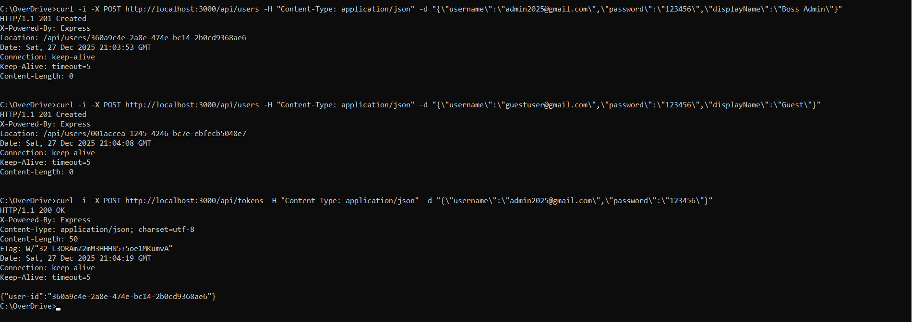
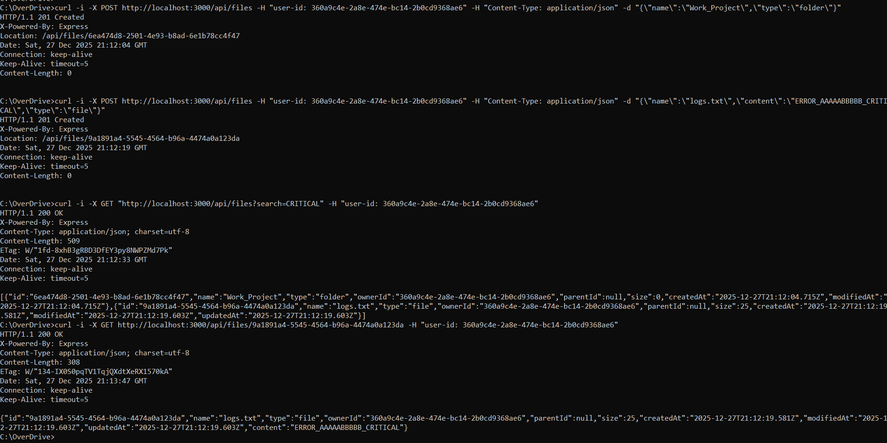
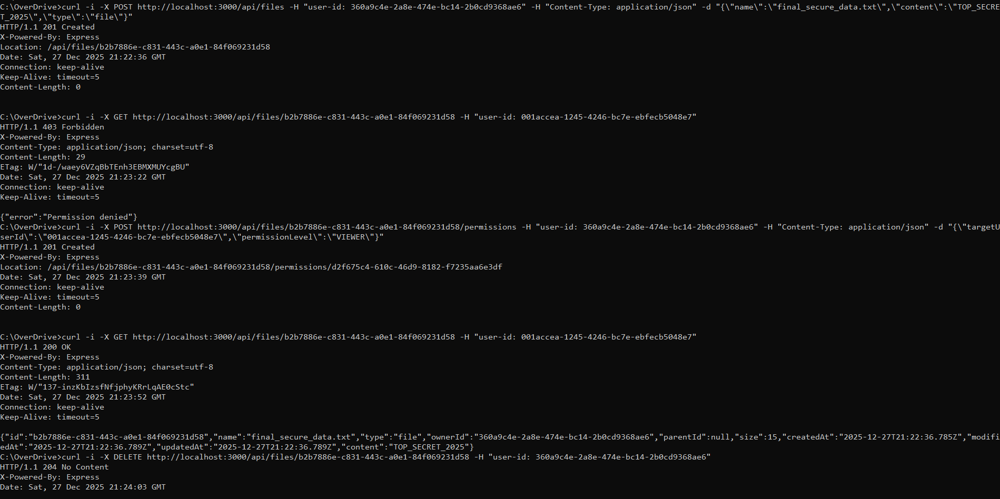

# OverDrive

A full-stack, distributed file storage system featuring a Node.js Web API layer and a high-performance C++ storage engine with RLE compression.

## Overview

OverDrive is a networked file storage system featuring:
- **Web Server (Node.js)**: Handles user authentication (Gmail-only), permissions, and file metadata.
- **Storage Server (C++)**: A high-performance engine for file persistence, featuring custom RLE compression and multi-threaded searching.
- **Security & Validation**: Strict email validation, password length checks, and owner-only file access.
- **RESTful API**: Clean HTTP interface for managing users and files.
- **Dockerized Microservices**: Seamlessly orchestrated using Docker Compose.

### System Architecture
The system is now split into three main services communicating over a private TCP bridge:
1. Client: Interacts with the system via curl or HTTP requests.
2. Web Server (Port 3000): Manages logic, users, and redirects data to the storage backend.
3. Storage Server (Port 5555): Manages physical file I/O, compression, and content-based search.


## Getting Started

### Prerequisites
- Docker & Docker Compose

### Step 1: Build & Start

```bash
docker-compose up --build -d
```
This command starts both the Web Server and the Storage Server.

### Step 2: Running Tests (Optional)
To verify the system integrity (C++ logic and Protocol):

```bash
docker-compose run --rm tests
```

## API Usage Guide (Interactive Demo)
Follow these steps to explore the system. Replace <...> values with actual IDs returned from the server.

### 1. Identity & Access
1.1 Register User
```Bash
curl -i -X POST http://localhost:3000/api/users \
     -H "Content-Type: application/json" \
     -d "{\"username\":\"<GMAIL_ADDRESS>\",\"password\":\"<PASSWORD>\",\"displayName\":\"<NAME>\"}"
```
Expected Response: 201 Created. Header Location contains the USER_ID.

1.2 User Login
```Bash
curl -i -X POST http://localhost:3000/api/tokens \
     -H "Content-Type: application/json" \
     -d "{\"username\":\"<GMAIL_ADDRESS>\",\"password\":\"<PASSWORD>\"}"
```
Expected Response: 200 OK. Body: {"user-id": "..."}.

1.3 Get User Profile
```Bash
curl -i -X GET http://localhost:3000/api/users/<USER_ID>
```
Expected Response: 200 OK. Body: User object (ID, username, displayName).

### 2. File & Folder Management
2.1 Create Folder
```Bash
curl -i -X POST http://localhost:3000/api/files \
     -H "user-id: <USER_ID>" \
     -H "Content-Type: application/json" \
     -d "{\"name\":\"Work_Project\",\"type\":\"folder\"}"
```
Expected Response: 201 Created. Header Location contains the FOLDER_ID.

2.2 Upload File (with RLE Compression)
```Bash
curl -i -X POST http://localhost:3000/api/files \
     -H "user-id: <USER_ID>" \
     -H "Content-Type: application/json" \
     -d "{\"name\":\"notes.txt\",\"content\":\"AAAAABBBBB\",\"type\":\"file\",\"parentId\":\"<FOLDER_ID_OR_NULL>\"}"
```
Expected Response: 201 Created. Data is automatically compressed in the C++ backend.

2.3 List All Files (Tree Root)
```Bash
curl -i -X GET http://localhost:3000/api/files \
     -H "user-id: <USER_ID>"
```
Expected Response: 200 OK. Returns an array of file/folder objects.

2.4 Get File Metadata & Content
```Bash
curl -i -X GET http://localhost:3000/api/files/<FILE_ID> \
     -H "user-id: <USER_ID>"
```
Expected Response: 200 OK. Content is transparently decompressed and returned as plain text.

2.5 Update File/Folder Name
```Bash
curl -i -X PATCH http://localhost:3000/api/files/<FILE_ID> \
     -H "user-id: <USER_ID>" \
     -H "Content-Type: application/json" \
     -d "{\"name\":\"new_filename.txt\"}"
```
Expected Response: 204 No Content.

2.6 Delete File/Folder
```Bash
curl -i -X DELETE http://localhost:3000/api/files/<FILE_ID> \
     -H "user-id: <USER_ID>"
```
Expected Response: 204 No Content.

### 3. Advanced Features
3.1 Smart Search (Name & Content)
```Bash
curl -i -X GET "http://localhost:3000/api/files?search=<TERM>" \
     -H "user-id: <USER_ID>"
```
Expected Response: 200 OK. Searches file names and performs deep-content search within compressed RLE data.

3.2 Grant Permissions (RBAC)
```Bash
curl -i -X POST http://localhost:3000/api/files/<FILE_ID>/permissions \
     -H "user-id: <OWNER_ID>" \
     -H "Content-Type: application/json" \
     -d "{\"targetUserId\":\"<GUEST_ID>\",\"permissionLevel\":\"VIEWER\"}"
```
Expected Response: 201 Created. Supported levels: VIEWER, EDITOR, OWNER.

---

## Project Execution Demo: Full User and File Lifecycle

### Phase 1: Identity & Access Management
This phase demonstrates the robustness of the user authentication and validation layer:

1. User Registration: POST /api/users - Creates a new user with strict email validation (minimum 6 characters) and secure password storage. Returns 201 Created.

2. Conflict Handling: POST /api/users - Attempts to register an existing email, proving the system prevents duplicate accounts. Returns 409 Conflict.

3. Secure Authentication: POST /api/tokens - Validates credentials and generates a unique user-id for session management. Returns 200 OK.



### Phase 2: Smart Storage & Content Search
This phase showcases the system's core storage capabilities and C++ integration:

1. File Hierarchy: POST /api/files - Supports creating both folders and files, establishing a structured file system.
2. RLE Compression: POST /api/files - Transmits data to the C++ storage server where it is compressed using Run-Length Encoding (RLE).
3. Smart Search: GET /api/files?search=... - Performs a deep-content search. The C++ server decompresses data on-the-fly to find matches within compressed files.
4. Data Retrieval: GET /api/files/:id - Seamlessly retrieves and decodes the storage, returning the original plain text to the user.



### Phase 3: Permissions, Security & Resource Lifecycle
This final phase demonstrates the complete lifecycle of a secure resource and the system's access control logic:

1. Resource Creation: POST /api/files – The owner (Admin) creates a new sensitive file. Returns 201 Created.

2. Unauthorized Access (Blocking): GET /api/files/:id – A Guest user attempts to access the file without permission. Returns 403 Forbidden, validating the security middleware.

3. Role-Based Permission Granting: POST /api/files/:id/permissions – The owner explicitly grants the VIEWER role to the Guest user. Returns 201 Created.

4. Authorized Access (Elevation): GET /api/files/:id – The Guest user attempts to access the file again. Now, with permissions granted, the system returns 200 OK and the decrypted content.

5. Secure Deletion: DELETE /api/files/:id – The owner removes the resource. Returns 204 No Content, confirming the file is purged from both the metadata and storage layers.



---

## API Reference

| Method | Endpoint | Required Headers | Description |
|:---:|:---|:---:|:---|
| `POST` | `/api/users` | - | **Register**: Create a new account (Gmail only, 4+ char password). `profileImage` is optional (Base64) and defaults to `null` |
| `GET` | `/api/users/:id` | `user-id` | **Get User Profile**: Retrieve user details (username, displayName, profileImage) |
| `POST` | `/api/tokens` | - | **Login**: Authenticate user and retrieve user-id |
| `POST` | `/api/files` | `user-id` | **Create**: Upload a new file or create a folder |
| `GET` | `/api/files` | `user-id` | **List All**: Retrieve all files and folders at root level (/) with permission|
| `GET` | `/api/files/:id` | `user-id` | **Fetch**: Get full metadata and content of a specific file/folder |
| `PATCH` | `/api/files/:id` | `user-id` | **Update**: Edit file/folder name or content or location |
| `DELETE` | `/api/files/:id` | `user-id` | **Delete**: Remove a file or folder (includes recursive deletion) |
| `GET` | `/api/files?search=...` | `user-id` | **Search**: Global search by name or content |
| `GET` | `/api/files/:id/permissions` | `user-id` | **Get Permissions**: Retrieve all permissions for a specific file/folder |
| `POST` | `/api/files/:id/permissions` | `user-id` | **Grant Permission**: Create new permission for a user (VIEWER, EDITOR, OWNER) |
| `PATCH` | `/api/files/:id/permissions/:pId` | `user-id` | **Update Permission**: Modify an existing permission level |
| `DELETE` | `/api/files/:id/permissions/:pId` | `user-id` | **Revoke Permission**: Remove a specific permission |

---

### Status Codes
- `200 OK` - Success.
- `201 Created` - Resource created successfully.
- `204 No Content` - Success with no response body (update/delete operations).
- `400 Bad Request` - Validation failed (e.g., invalid email, missing fields).
- `401 Unauthorized` - Missing or invalid user-id.
- `403 Forbidden` - User lacks permission to access the resource.
- `404 Not Found` - Resource or User does not exist.
- `409 Conflict` - Resource already exists (e.g., duplicate username).

---

## Architecture

The system follows SOLID principles with a strict separation of concerns between the user-facing API and the performance-critical storage backend.

```
┌─────────────────────────────────────────────────────────────┐
│                        Web Client                           │
│                   (Browser / cURL / Postman)                │
└─────────────────────────┬───────────────────────────────────┘
                          │ HTTP/JSON (port 3000)
┌─────────────────────────▼───────────────────────────────────┐
│                   Web Server (Node.js/Express)              │
│  ┌─────────────┐  ┌──────────────┐  ┌────────────────────┐  │
│  │ Permission  │─▶│ File/Folder  │─▶│   Storage Client   │  │
│  │    Store    │  │  Controller  │  │   (TCP Wrapper)    │  │
│  └─────────────┘  └──────────────┘  └─────────┬──────────┘  │
└───────────────────────────────────────────────│─────────────┘
                          │ TCP Socket (port 5555)
┌─────────────────────────▼───────────────────────────────────┐
│                  Storage Server (C++17)                     │
│  ┌─────────────┐  ┌──────────────┐  ┌────────────────────┐  │
│  │   Parser    │─▶│   Executor   │─▶│  RLE Compression   │  │
│  └─────────────┘  └──────────────┘  └─────────┬──────────┘  │
│  ┌────────────────────────────────────────────▼──────────┐  │
│  │                 File Management Layer                 │  │
│  │  ┌────────────┐  ┌────────────┐  ┌─────────────────┐  │  │
│  │  │Thread-Safe │─▶│  Hashing   │─▶│  Local Storage  │  │  │
│  │  └────────────┘  └────────────┘  └─────────────────┘  │  │
│  └───────────────────────────────────────────────────────┘  │
└─────────────────────────────────────────────────────────────┘
```

---

## Project Structure

```
OverDrive/
├── web-server/                # Node.js API Layer (Microservice)
│   ├── server.js              # Entry point & Express configuration
│   ├── controllers/           # Route logic (User, File, Search)
│   ├── routes/                # REST API endpoint definitions
│   ├── models/                # Data structures & In-memory stores
│   ├── services/              # Business logic & TCP Storage Client
│   └── middleware/            # Auth & Error handling
├── storage-server/            # C++ Storage Engine (Microservice)
│   ├── src/
│   │   ├── commands/          # POST, GET, DELETE, SEARCH implementations
│   │   ├── communication/     # TCP Socket handling
│   │   ├── file/              # RLE Compression & File management
│   │   ├── server/            # Main server loop (server_main.cpp)
│   │   └── threading/         # ThreadPool & Thread management
│   └── tests/                 # C++ Unit tests (GTest)
├── Client/                    # Legacy C++/Python clients
├── Common/                    # Shared interfaces & Protocol definitions
├── docker-compose.yml         # Multi-container orchestration
└── CMakeLists.txt             # C++ Build configuration
```

---


## The system performs a dual search on both file names and content, with filtering:

1. Metadata Search – The Web Server searches for files and folders by name, limited to those the user has access to.
2. Content Search – Requests for content search are sent to the C++ Storage Server. Since the server may return IDs of irrelevant files (due to its internal ID system), results are filtered to include only files the user can access. An additional check is performed on the file content to confirm a real match, and any non-matching files are discarded.

---

## Known Limitations

- Gmail Restriction:
     
     Only @gmail.com addresses are allowed for registration.
     
     Username requirements: Must be between 6–30 characters.
     
     If the user enters the username without @gmail.com, it is automatically appended.
     
     Normalization is applied: dots (.) and uppercase letters are ignored or converted to lowercase.
- In-Memory Users: User data resets on Web Server restart (unless persistent store is attached).
- Search Case-Sensitivity: Search is currently case-sensitive.

---

## License

This project is part of an academic exercise in Advanced Systems Programming.
