# OverDrive: Part 4 - React Full-Stack UI

A full-stack, distributed file storage system with a C++ storage engine, Node.js API layer, and React client — inspired by Google Drive.                        

## Overview

OverDrive is a networked file storage system built as three Docker-orchestrated microservices: a high-performance C++ storage engine with custom RLE compression, a Node.js/Express RESTful API handling authentication and business logic, and a React 19 single-page application providing a Google Drive-like user experience. The system supports multi-user collaboration with role-based access control, recursive folder permissions, and owner-based storage quotas.                    

## Key Features

- **JWT-based authentication** — Gmail-only registration with secure token management                                                                           
- **Role-based access control** — OWNER / EDITOR / VIEWER with recursive folder permission inheritance                                                          
- **File types** — docs (editable), pdf (read-only), image (read-only), folder
- **Custom RLE compression** — Run-Length Encoding in the C++ storage engine
- **Multi-threaded content search** — Parallel search across compressed files
- **Owner-based storage quotas** — Configurable per-user limits (default 100 MB)
- **Star, recent files & trash management** — With full restore capabilities
- **File/folder operations** — Copy, move, rename, download, and folder export
- **Advanced filtering** — Via HTTP headers (type, date range, ownership)
- **Dark/light theme** — With persistent user preferences
- **Fully Dockerized** — Microservice architecture with Docker Compose orchestration                                                                            

## Architecture

```text
Client (Browser :3001)
        │
        │ HTTP/JSON
        ▼
Web Server (Node.js :3000)
        │
        │ TCP Socket
        ▼
Storage Server (C++ :5555)
```

## Application Walkthrough

### Step 1: Welcome Page
The guest landing page shown when visiting the app for the first time, featuring OverDrive branding with options to sign up or log in.                          
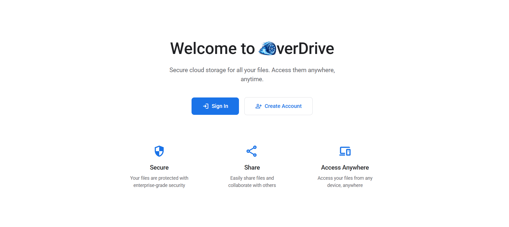

### Step 2: Registration
New user registration form requiring a Gmail address, password (8+ characters with letters and numbers), first name, and profile image upload. Last name is optional. Includes client-side validation with clear visual feedback.               
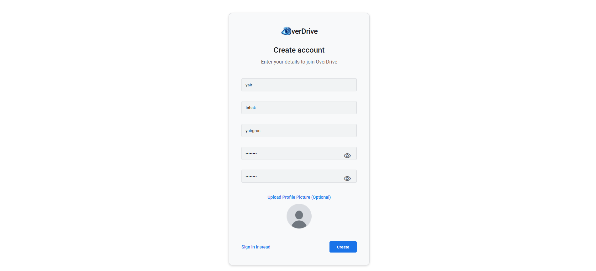

### Step 3: Login
User authentication page where existing users enter their Gmail and password to receive a JWT token for session management.                                     
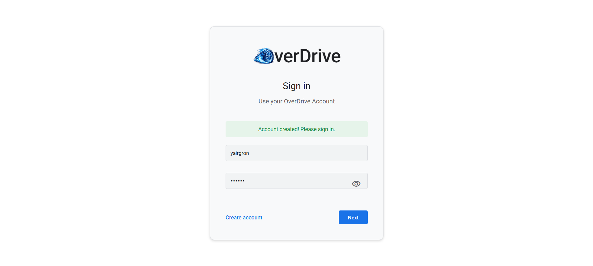

### Step 4: Home Page (Dashboard)
The main dashboard after login showing recently accessed files, starred files, and a storage overview. The sidebar provides navigation to My Drive, Shared, Starred, Recent, Trash, and Storage.                                                
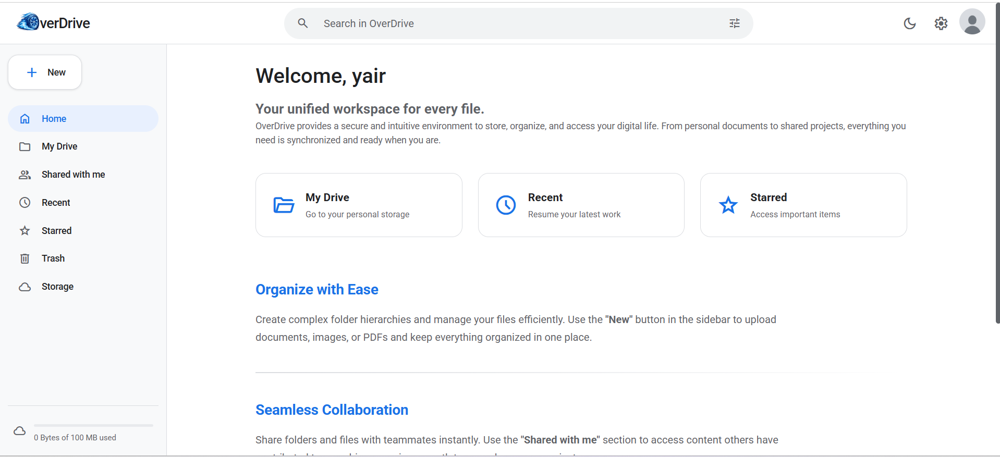

### Step 5: My Drive — File & Folder Management
The main file management view where users can create folders, upload files (text, pdf, image), and organize their file hierarchy with list/grid views and action buttons.                                                                       
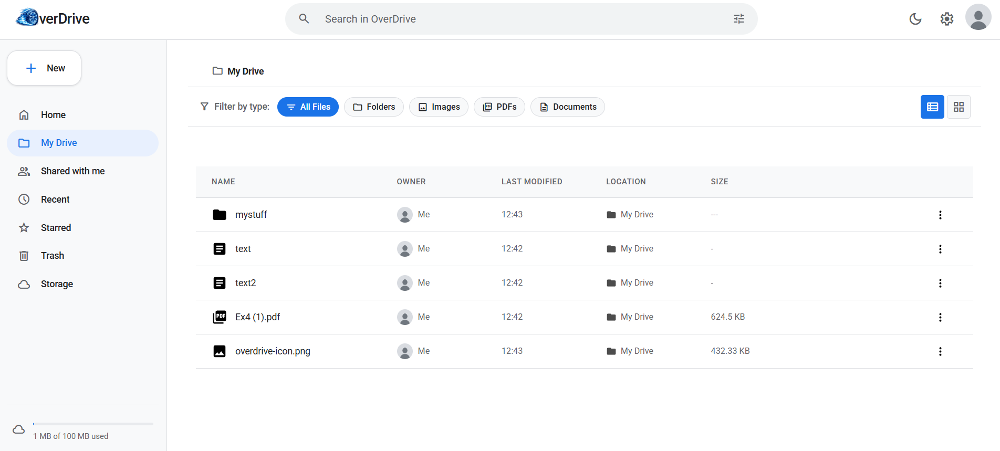
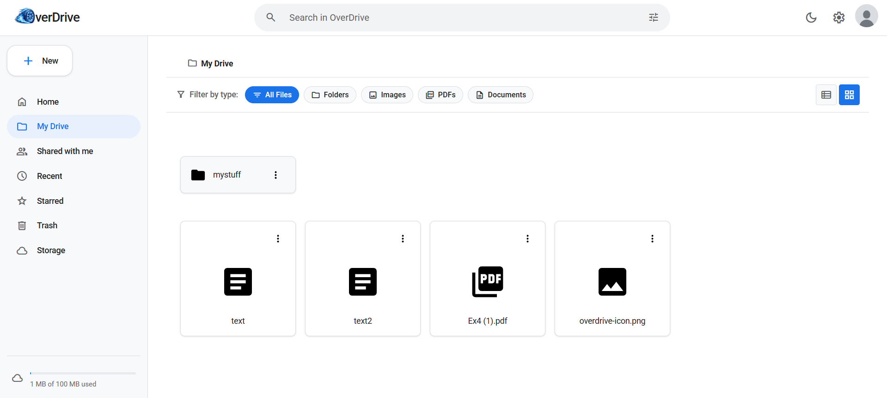

### Step 6: Creating a New File/Folder
Demonstrates the creation dialog for new documents and folders, with type selection and content input.                                                          
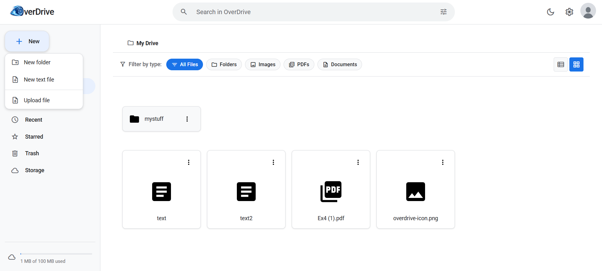

### Step 7: Moving & Organizing Files
Moving files between folders using the move action. Demonstrates reorganizing the file hierarchy by changing a file's parent folder.                            
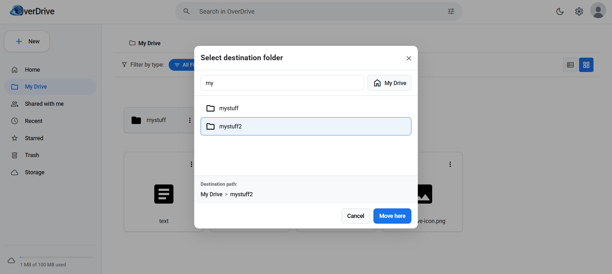

### Step 8: File Preview & Details
Previewing a file's content inline — document text, PDF rendering, or image display. File metadata (size, type, dates) is visible alongside the content.        
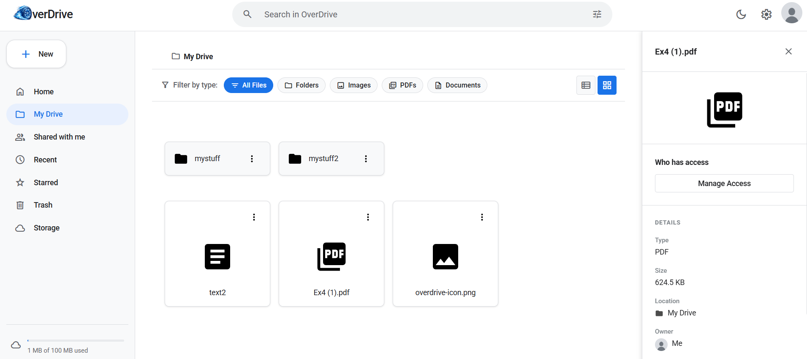

### Step 9: Search Functionality
The search bar in action, showing results filtered by name and/or content with advanced filtering options for type, date, and ownership.                        
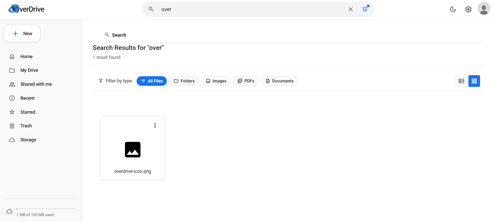

### Step 10: File Sharing & Permissions
The share modal where users grant VIEWER or EDITOR permissions to other users, with a permissions management interface showing current collaborators.           
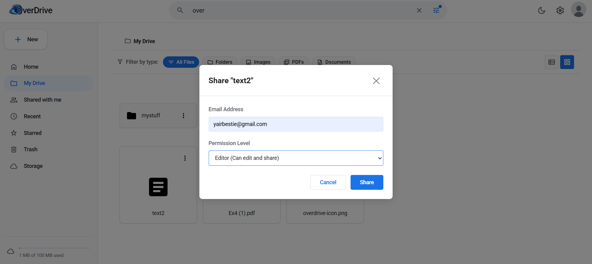

### Step 11: Trash Management
The trash page showing deleted files with options to restore individually, restore multiple, or permanently delete. Demonstrates the two-step deletion safety mechanism.                                                                        
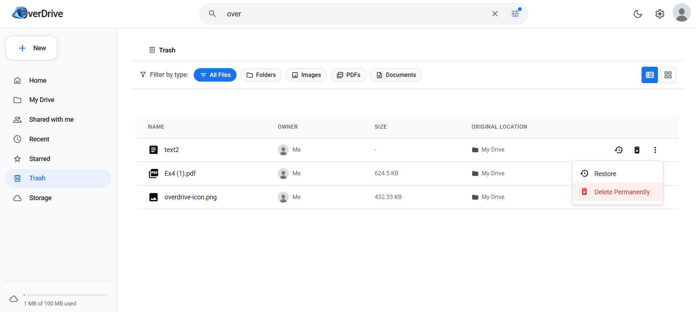

### Step 12: Settings & Preferences
The settings page where users can manage their account details (name, profile image) and configure general preferences — theme (light/dark), default landing page (home/storage), and more.                                                     
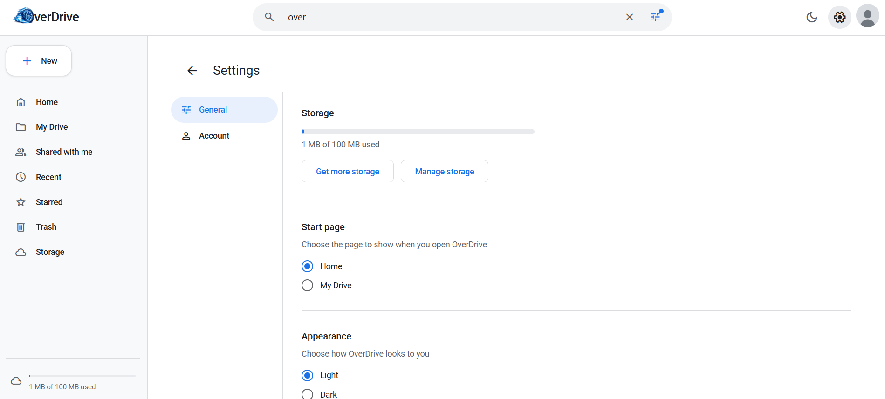

### Step 13: Dark Mode
The application in dark mode, toggled via the theme switch. Theme preference persists across sessions via the user preferences API.                             
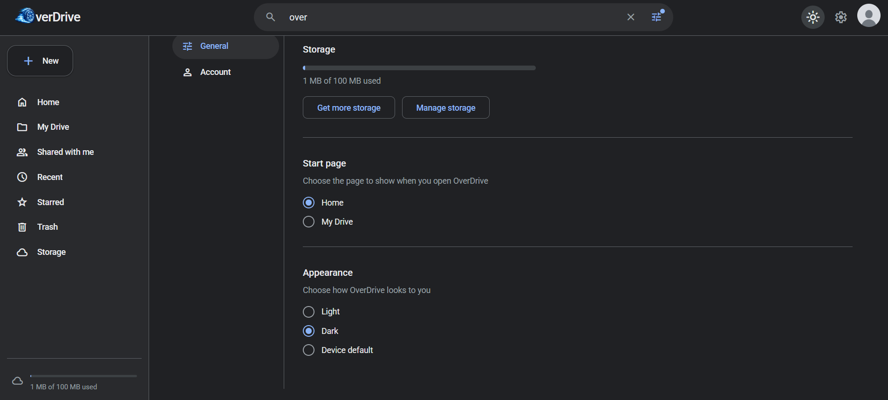

### Step 14: Storage Management
The storage page displaying used and available space with a visual progress indicator, demonstrating the owner-based quota system.                              
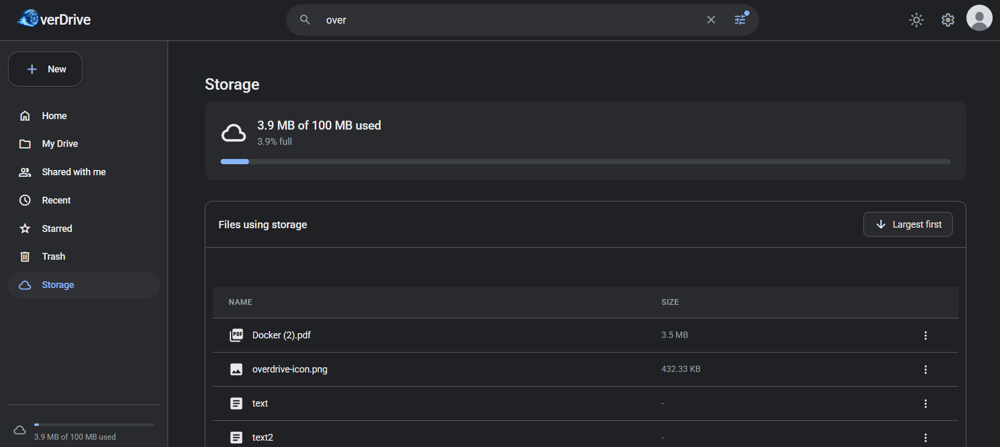

## API Reference

| Method | Endpoint | Auth | Description |
|--------|----------|:----:|-------------|
| `POST` | `/api/users` | ✗ | Register new user |
| `GET` | `/api/users/:id` | ✓ | Get user profile |
| `PATCH` | `/api/users/:id` | ✓ | Update user profile |
| `GET` | `/api/users/:id/preference` | ✓ | Get user preferences |
| `PATCH` | `/api/users/:id/preference` | ✓ | Update user preferences |
| `POST` | `/api/tokens` | ✗ | Login (get JWT) |
| `GET` | `/api/storage` | ✓ | Get storage info |
| `POST` | `/api/files` | ✓ | Create file/folder |
| `GET` | `/api/files` | ✓ | List root files |
| `GET` | `/api/files/starred` | ✓ | Get starred files |
| `GET` | `/api/files/recent` | ✓ | Get recent files |
| `GET` | `/api/files/owned` | ✓ | Get owned files |
| `GET` | `/api/files/shared` | ✓ | Get shared files |
| `GET` | `/api/files/:id` | ✓ | Get file details |
| `GET` | `/api/files/:id/download` | ✓ | Download file / export folder |
| `PATCH` | `/api/files/:id` | ✓ | Update file/folder |
| `POST` | `/api/files/:id/star` | ✓ | Toggle star |
| `POST` | `/api/files/:id/copy` | ✓ | Copy file/folder |
| `DELETE` | `/api/files/:id` | ✓ | Move to trash / hide |
| `GET` | `/api/files/trash` | ✓ | List trash |
| `DELETE` | `/api/files/trash/:id` | ✓ | Permanent delete |
| `POST` | `/api/files/trash/:id/restore` | ✓ | Restore from trash |
| `DELETE` | `/api/files/trash` | ✓ | Empty trash |
| `POST` | `/api/files/trash/restore` | ✓ | Restore all trash |
| `GET` | `/api/search/:query` | ✓ | Search files |
| `GET` | `/api/files/:id/permissions` | ✓ | Get permissions |
| `POST` | `/api/files/:id/permissions` | ✓ | Grant permission |
| `PATCH` | `/api/files/:id/permissions/:pId` | ✓ | Update permission |
| `DELETE` | `/api/files/:id/permissions/:pId` | ✓ | Revoke permission |